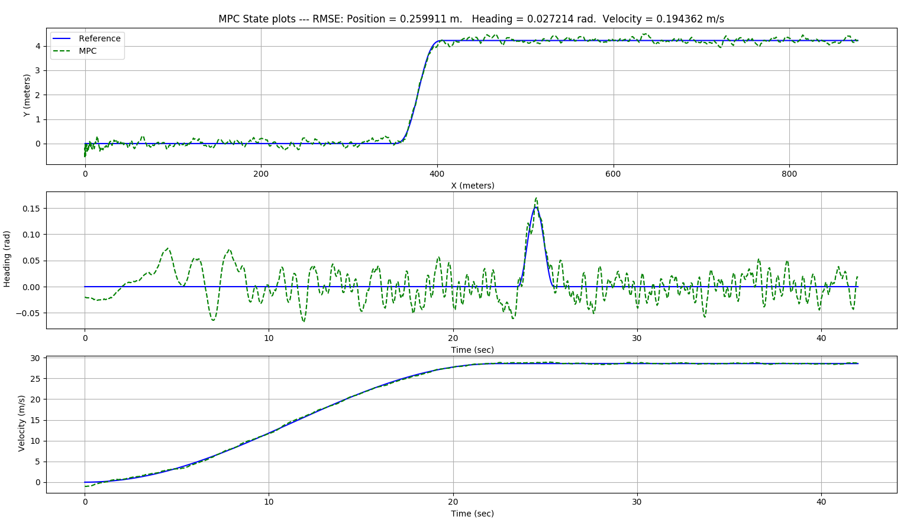
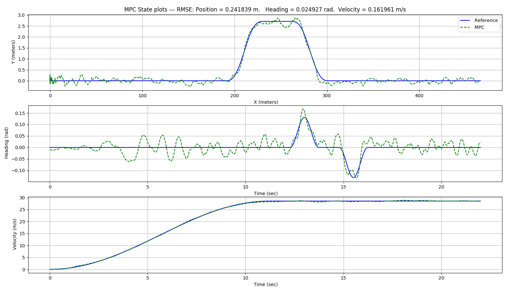

# vehicle-mpc-controller
- Library for simulating, testing and tuning a Model Predictive Controller (MPC) for autonomous vehicles.
- Currently the code uses either a unicycle or bicycle model (with ackermann steering) to model the dyanmics of the vehicle. 
- The objective of the controller is to track a given reference trajectory in the presence of added process noise. 
- The non-linear dynamics of the system are linearized about the reference trajectory. 
- The MPC problem for the linearized system is then cast as a constrained Quadratic Programming (QP) problem. 
- The constrained QP problem is solved using the OSQP optimization library and its C++/Eigen wrapper


## Dependencies
- [boost v1.58](https://www.boost.org/users/history/version_1_58_0.html)
- [osqp](http://osqp.readthedocs.io/en/latest/index.html)
- [osqp-eigen](https://github.com/robotology/osqp-eigen)
- [Eigen3](http://eigen.tuxfamily.org/index.php?title=Main_Page)
- [cmake v3.0+](https://cmake.org/)
- [googletest](https://github.com/google/googletest) (only for testing).

## Third-party software used:
- [spdlog](https://github.com/gabime/spdlog) - For logging/debugging
- [json](https://github.com/nlohmann/json) - For reading in params
- [matplotlib-cpp](https://github.com/lava/matplotlib-cpp) - For plotting

## Building
### Linux
```sh
git clone https://github.com/vTechSavyy/vehicle-mpc-controller.git
cd vehicle-mpc-controller
mkdir build && cd build
cmake ../
make
```
## Running an example: 
```sh
./mpc-bicycle-double-lane-change
```

The params of the simualtion and mpc-controller are set through a json file in the `params` folder

## Results

### Bicycle model - Lane change maneuver 


### Bicycle model - Double lane change maneuver 


## References:
- [OSQP paper](https://web.stanford.edu/~boyd/papers/pdf/osqp.pdf)
- [A brief introduction to MPC](https://www.itk.ntnu.no/fag/TTK4135/Pensum/MPCkompendium%20HOvd.pdf)

## Todo list: 
- Interface this library with a high-level planner that provides the reference
- Interface with an open source simualtor (eg: Gazbeo or Webots) for better testing
- Parmeterize the linearized error dynamics in terms of lateral and longitudinal errors w.r.t the reference trajectory. 
- Compare mpc with other control methods (eg: Pure pursuit, PID)
- Any further suggestions/feedback is always welcome. 
